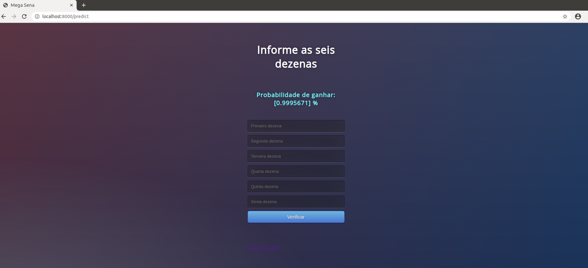
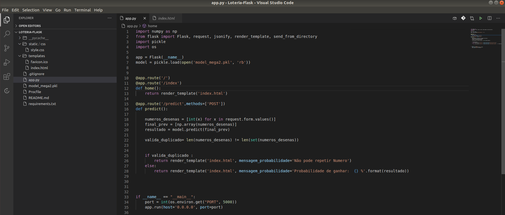
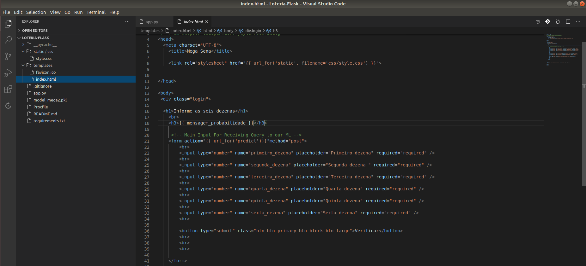

# Mega Sena e Loterias da Caixa com Machine Learning + Flask + Heroku
**Loteria-Flask**
Modelo Preditivo para Loterias  (Flask+API)

Criação de um modelo que mostre a probabilidade de acerto de um jogo da Mega Sena.
Se apostarmos 1 jogo de seis dezenas, a probabilidade de ganharmos é de um em 50.063.860, que corresponde a 0,000002 % de chance de ganhar ¹.
Minha proposta é mostrar a probabilidade acima de 0,000002 % de um jogo de seis dezenas que será sorteado.

**Visao Geral**
Python
Flask
Jupyter Notebook
Heroku

https://loteria-flask.herokuapp.com/

### Site Heroku

### Flask

### Html

¹ Fonte: Loterias da Caixa Econômica Federal.
http://loterias.caixa.gov.br/wps/portal/loterias/landing/megasena/
